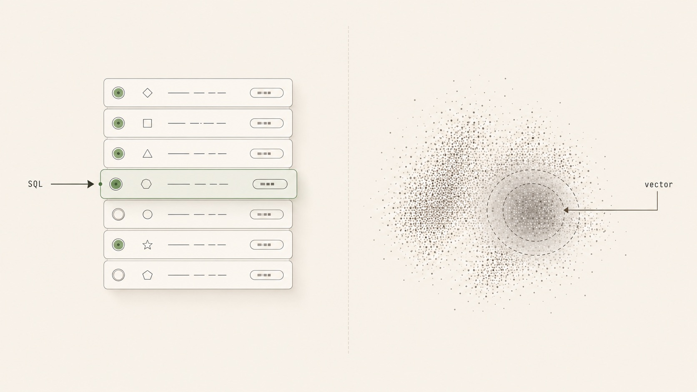
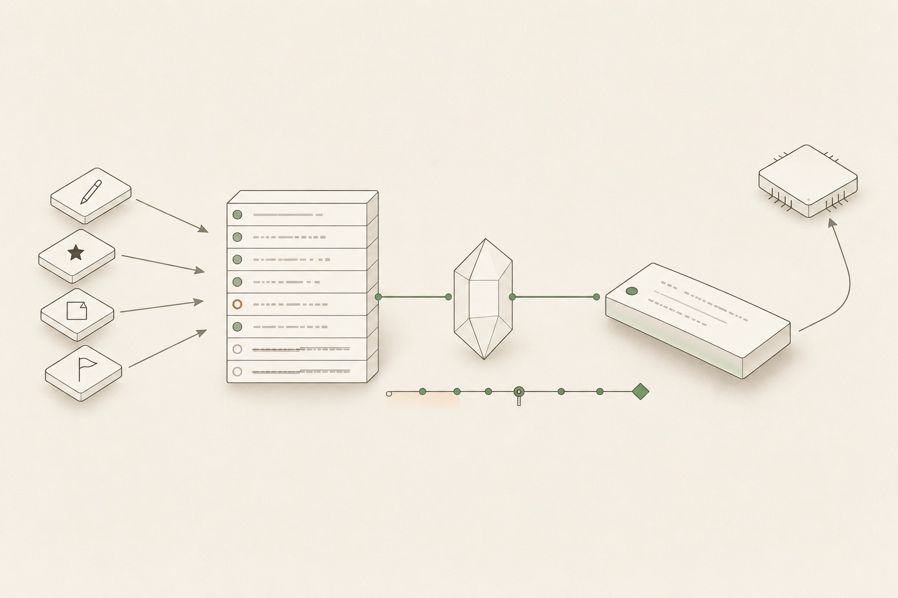

<div align="center">

# Memory Ledger

### A relational-database approach to agent memory: recorded as a ledger, not vector embeddings

[](LICENSE) &nbsp; &nbsp; &nbsp;

<sub><a href="README.md">简体中文</a> &nbsp;|&nbsp; <b>English</b></sub>

<p>
Record every statement (who said what, which field changed) as one <b>typed intent</b> row in a single <b>ledger table</b>.<br>
When you need it, plain <b>SQL</b> replays those rows by timestamp into "the truth as of now", <b>deterministic and reproducible</b>.<br>
<sub>The read path never touches vectors or an LLM · swap in your own business tables to reuse it · not RAG / vectors / a knowledge graph</sub>
</p>

<table>
<tr>
<td align="center">❌ &nbsp;<b>vector-first (mainstream)</b></td>
<td align="center">✅ &nbsp;<b>relational-first (this project)</b></td>
</tr>
<tr>
<td align="center">memory stored in an approximate embedding index<br><sub>non-deterministic · drifts with the model · hard to query exactly · unreadable</sub></td>
<td align="center">memory is a <b>ledger row</b> in a relational table<br><sub>deterministic SQL · time travel · auditable</sub></td>
</tr>
</table>

<sub>🧾 Co-located ledger &nbsp;·&nbsp; ⏳ As-of (point-in-time) replay &nbsp;·&nbsp; 🚦 Human gate by default &nbsp;·&nbsp; 🔢 DB-enforced 4 kinds</sub>

</div>

---

## 💡 Overview

<div align="center">

<br><sub>A diffuse vector approximation (left) passes through a human gate (center) and converges into an <b>ordered, queryable, replayable ledger of truth</b> (right)</sub>
</div>

Anything worth recording in memory (stating a fact, changing a field, adding a note, flagging a doubt) becomes its own intent row in the ledger table `l15_change_intents`, and old rows are never overwritten. When you need "the truth as of now", the SQL function `effective_*_at(as_of)` deterministically replays one entity's relevant rows up to a given timestamp and synthesizes the result.

> Cross-session memory relies on **SQL and timestamps**, not embeddings and similarity.

- **Design and reference implementation**: a layered architecture that keeps the ledger core separate from your business entities.
- **Easy to extend**: swap in your own business tables and reuse the core logic unchanged.
- **Examples are fictional**: a made-up TodoAgent runs through the docs, and Keepbook (念念手记) is only a visual shell.

---

## ⚖️ A relational database, not embeddings

Here, memory is a **ledger row** in a relational table. Reads go straight through SQL, so the result is deterministic and reproducible and never passes through a vector index. The mainstream `vector-first` approach does the opposite: it stores memory in a separate embedding (vector) index.

> The difference is not **whether you use a database** (Letta and Mem0 also run on Postgres, but they store vectors). It is that **the relational store is the source of truth, SQL does the recall, and the read path has no embeddings**.

<div align="center">

<br><sub>Left: SQL <b>hits one exact row</b> &nbsp;·&nbsp; Right: a vector index can only return <b>an approximate cluster</b>. Deterministic vs. drift.</sub>
</div>

Mechanically, this is **event sourcing over your existing business tables**: every intent must be one of `PATCH` / `ASSERT` / `ANNOTATE` / `FLAG`, enforced at write time by a Postgres `CHECK` constraint. The ledger and the business tables live in the same database and the same transaction, so there is no second copy to keep in sync.

### Compared to mainstream approaches

| Dimension | 🔎 Vector Memory | 🕸️ Temporal KG | 🧾 **Memory Ledger** |
|---|---|---|---|
| **Storage** | own vector store | own graph DB | **business tables + one ledger table, same DB** |
| **Recall (retrieval)** | embedding approximation | vectors + graph + rerank | **pure SQL, no embeddings / LLM** |
| **Determinism** | ❌ | ❌ | ✅ **bit-for-bit reproducible** |
| **Time travel** | ❌ | 🟡 fact intervals | ✅ **whole-state replay at any point** |
| **Retract / revise** | overwrite | invalidate, not delete | **a new row supersedes the old, forming a chain; revertible** |
| **Human gate** | ❌ | ❌ | ✅ **default: field edits need confirmation** |
| **Provenance** | thin (almost none) | episode-level | **verbatim quote + source ranking + conflict arbitration** |
| **Typing** | none / optional | app-layer ontology | ✅ **DB-CHECK-enforced fixed 4 kinds** |
| **Embedding model** | re-embed on model change | re-embed | **decoupled, no re-embedding** |

> **Boundary**: none of these is novel on its own (bitemporal databases, Zep / Graphiti, and Letta each do one of them). The real difference is the **combination**: a co-located ledger × deterministic as-of × a default human gate × DB-enforced 4-kind strong provenance, all four at once.

**Complementary**: vectors are the semantic index, Memory Ledger the factual ledger. It does not compete on "remembering whatever gets said"; it handles "auditable, revertible, time-travelable structured changes".

---

## 🗺️ Core abstraction

An intent is recorded; `effective_*_at(as_of)` then replays it deterministically by timestamp to synthesize the truth at any moment, ready for the next LLM turn.

<div align="center">

<br><sub>Four intent kinds flow into a <b>single ledger table</b> → <b>deterministic replay</b> by timestamp → <b>the truth as of now</b> → fed to the next LLM turn</sub>
</div>

**Key fields of the ledger row `l15_change_intents`:**

| Field | Values / meaning |
|---|---|
| `kind` | `PATCH` / `ASSERT` / `ANNOTATE` / `FLAG`: 4 kinds enforced by DB `CHECK` |
| `status` | `PROPOSED → APPLIED → SUPERSEDED \| REJECTED \| EXPIRED` (5-state) |
| `source_layer` | `USER_DIRECT > L2_FORM > L2_CHAT > L2_VOICE > AGENT_INFERENCE` (decreasing authority) |
| `source_quote` | the verbatim quote it was drawn from |
| `confidence` | confidence from `0` to `1` |

---

## 🧠 As Agent Memory infrastructure

The ledger is itself a layer of **Agent Memory infrastructure**: a structured record you can query precisely, rather than an opaque blob of vectors.

<div align="center">

<br><sub>A <b>thin tool layer</b> (top) sits above the <b>thick ledger</b> (bottom); one query pulls up the whole chain. Thin tools, emergent intelligence.</sub>
</div>

- **🪶 No preloaded memory**: you do not load the whole memory into context up front. When the agent needs it, one tool call returns a full picture of an entity: the current truth, verbatim provenance, open flags, the change chain, and any historical point in time.
- **🧰 Thin tools**: a tool is just a thin wrapper over the ledger's read capability. Truth synthesis and point-in-time replay live in the infrastructure, so adding a tool costs almost nothing.
- **✨ Emergent intelligence**: even on a cold start with no context, a single query returns enough history that the agent knows the entity well. This continuous memory comes from "infrastructure + thin tools", not from stacking context or clever prompts.

---

## 🧭 Determinism and human judgment

Recent agent engineering increasingly values two things: **deterministic, reproducible execution**, and **keeping a human in the loop**. Memory Ledger was built this way from the start:

- **⚙️ Determinism**: reads run on pure SQL, the same input always yields the same result, it is bit-for-bit reproducible, and it is easy to audit.
- **🤝 Human in the loop**: editing an existing field must pass a human gate. The agent only proposes (`PROPOSED`); a change takes effect (`APPLIED`) only after a person confirms it. Every change carries a verbatim quote for review.

<div align="center">

<br><sub>Data moves along a <b>deterministic track</b>; a field edit takes effect only after the single <b>human gate</b>. Rejected ones leave a trace (red).</sub>
</div>

> Models keep getting stronger, but experience and judgment still belong to people.

---

## 🎬 Demo

The ledger is just a set of rows in a database and is not visible on its own. To make it concrete, the demo below uses a conversational Personal-CRM shell driven by a real `live` LLM (DeepSeek). The example contact is **Lin Siying** (role: Product Manager → CTO; employer: Chenxing → Lanhu → Globex). **The shell is only a demo; the design above is the real deliverable.**

<div align="center">

<br><sub><b>Keepbook (念念手记) and its assistant Xiaoben (小本)</b>: a visual shell for the database idea</sub>
</div>

### 🧠 Cross-session memory

In a brand-new, empty conversation, ask "what is her current role". With no prior context, the system still calls `get_contact` and answers **CTO**: memory is stored per entity and shared across sessions.

<div align="center">

<br><sub>Left: a new empty thread &nbsp;·&nbsp; Right: the Globex / CTO contact card &nbsp;·&nbsp; hit with no prior context</sub>
</div>

### 🔧 Streaming tool calls

Before answering, the UI streams the tool call (`get_contact` running → done) and then replies. This shows the answer comes from a live backend query.

<div align="center">

<br><sub>Retrieve first, then answer &nbsp;·&nbsp; the data comes from past sessions</sub>
</div>

### 🚦 Confirmation gate

"She was promoted to CTO" edits an existing field, so a **confirmation gate** appears at the bottom and the change is written only after you confirm.

<div align="center">

<br><sub>"Role → CTO ‹Not now / Confirm›" &nbsp;·&nbsp; an unconfirmed change does not enter the effective truth (PROPOSED)</sub>
</div>

### 🧾 Ledger and provenance

The "Change log" panel on the right keeps every change: the supersede chain on the left, the verbatim provenance on the right.

<div align="center">

<br><sub>📐 <b>Schematic</b> · a new row supersedes the old to form a chain, with the verbatim source and confidence attached; rejected and pending items are recorded too</sub>
</div>

<div align="center">
<table>
<tr>
<td align="center"></td>
<td align="center"></td>
</tr>
<tr>
<td align="center"><sub>📜 <b>Change chain</b>: Globex ← Lanhu ← Chenxing (supersede)</sub></td>
<td align="center"><sub>🔍 <b>Verbatim provenance</b>: original quote + 100% confidence + source layer</sub></td>
</tr>
</table>
</div>

### ⏳ Time travel (as-of)

Drag the timeline and the contact card rebuilds the truth at that moment: Chenxing → Lanhu → Globex, each synthesized by `effective_*_at` from the 1 / 2 / 4 rows that existed then.

<div align="center">

<br><sub>📐 <b>Schematic</b> · drag the timeline and the same card is deterministically rebuilt from the <b>1 / 2 / 4</b> rows that existed then</sub>
</div>

<div align="center">
<table>
<tr>
<td align="center" width="33%"></td>
<td align="center" width="33%"></td>
<td align="center" width="33%"></td>
</tr>
<tr>
<td align="center"><sub><b>Chenxing</b> · from 1 row</sub></td>
<td align="center"><sub><b>Lanhu</b> · from 2 rows</sub></td>
<td align="center"><sub><b>Globex</b> · from 4 rows</sub></td>
</tr>
</table>
</div>

### 🚫 Rejections and doubts leave a trace

It records more than successful changes. Rejected (REJECTED) and pending (FLAG) items are equally auditable.

<div align="center">

<br><sub>"Location → Berlin" not accepted &nbsp;·&nbsp; "relocation pending" &nbsp;·&nbsp; the 5-state machine traces the whole path</sub>
</div>

### 💭 Deep thinking

Once enabled, the reasoning streams out first and then collapses into a structured suggestion, wired to the backend reasoning path.

<div align="center">
<table>
<tr>
<td align="center"></td>
<td align="center"></td>
</tr>
<tr>
<td align="center"><sub>reasoning streams out</sub></td>
<td align="center"><sub>collapses into a suggestion</sub></td>
</tr>
</table>
</div>

---

## 🐳 Run locally

Docker is all you need:

```bash
cp .env.example .env       # set LLM_API_KEY for a real LLM; leave empty for mock
docker compose up --build  # start db + api + web
# open http://localhost:8080
docker compose down -v     # tear down (including the data volume)
```

| Service | Port | Notes |
|---|---|---|
| `web` | 8080 | React frontend (nginx + reverse proxy for `/api`) |
| `api` | 8000 | FastAPI (SSE chat / time travel / ledger / gate) |
| `db` | 5433 | Postgres |

> It starts without `LLM_API_KEY` too: seed data, time travel, provenance, and the ledger are all viewable, and only chat falls back to mock. To switch models, change three environment variables (via LiteLLM; see `.env.example`).
>
> Command-line demo: `docker compose --profile demo run --rm demo`. The repo has 103 tests (`pytest` + testcontainers).

---

## ✅ When to use it

Rule of thumb: **when precise, traceable, accountable recall matters more than broad, associative recall, use a ledger.** The more of these traits you have, the better the fit:

- **Memory is structured business state** (entities and fields), not free-form text.
- **The state gets revised repeatedly**, and you care about the history of changes, not just the latest value.
- **Getting it wrong has a cost**: you need exact recall, audits, and rollback, and important changes need a person to confirm them.

Typical cases:

- **Planning / project / task management**: tasks, owners, and due dates change constantly, and you need to look back at "the plan as of some moment".
- **CRM / contact records**: roles, employers, and preferences keep updating; mistakes can be rolled back and leave a paper trail.
- **Tickets / cases / compliance records**: who changed which field, when, and on what basis must be accountable.
- **A structured record the agent keeps correcting**: user profiles, configuration, decision logs, and the like.

---

## 🚧 When not to use it

- **Arbitrary open-ended content** (long-tail preferences): use a vector memory instead.
- **Entities whose field structure changes often**: schema migrations and `effective_*_at` would have to be rewritten in lockstep, which costs too much.
- **Only approximate recall / fuzzy matching is needed**: this approach is built for exact recall.
- **Only a log is needed**: an append-only log table is enough.

---

## 📌 Notes

- The example entities and data are fictional placeholders (TodoAgent / Keepbook). Swap in your own business entities to extend it.
- Reuse at your own risk.

---

## 📮 Contact

<div align="center">

[](mailto:huangsuxiang5@gmail.com) &nbsp; &nbsp;

</div>

---

## 📄 License

This project is open-sourced under the **[Apache License 2.0](LICENSE)**. See [`LICENSE`](LICENSE) and [`NOTICE`](NOTICE).
