<div align="center">


# L1.5 Intent Ledger

### 给 LLM Agent 的 `relational-first` 记忆 — 不是 RAG,不是 vector,不是知识图谱

<p>
按状态机记账 · 可时间旅行 · 每条事实带逐字溯源<br>
<sub>一份能直接 copy 的 agent memory 设计 + 模板代码 · live demo 门面「念念手记」,对话助手「小本」🌱</sub>
</p>

<sub>🧾 同库账本 &nbsp;·&nbsp; ⏳ 确定性 as-of 时间旅行 &nbsp;·&nbsp; 🚦 默认人工闸门 &nbsp;·&nbsp; 🔢 DB 强制 4-kind</sub>

<br><br>

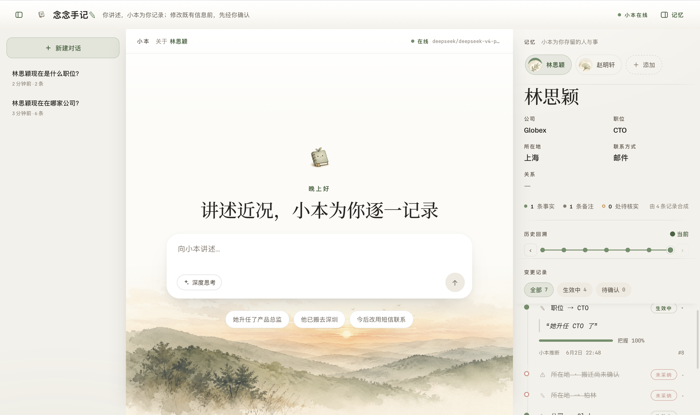

</div>

---

## 💡 这是什么

一句话: **把 agent 跟用户的每一次"事实陈述 / 字段改动 / 注释 / 标疑" 记成一条 intent, 写进同一张账本表 (`l15_change_intents`), 然后通过 PG view 函数 (`effective_*_at(as_of_ts)`) 按时间戳合成"截至此刻的真相", 给 agent 下一轮当 context.**

跨会话记忆就这样实现 — 不靠 embedding, 不靠相似度.

文档全程用一个虚构的 **TodoAgent** (帮用户管理待办清单的 LLM agent) 当例子贯穿. 你 copy 走改 schema 适配自己业务即可.

---

## 🎬 看它跑起来

> 下面每一帧都在真实 `live` LLM(DeepSeek)上跑出来的 —— 不是 mockup。例子里的联系人是 **林思颖**(资深产品经理 → CTO,公司一路 晨星科技 → 蓝湖科技 → Globex)。

### 🧠 跨会话记忆 — 头号卖点

点「新建对话」开一个**全新空白线程**,问一句"她现在什么职位?",小本照样调 `get_contact` 直接答 **CTO**。记忆是按**人**全局留存、**跨会话共享**的 —— 换个对话窗口照样记得。

<div align="center">
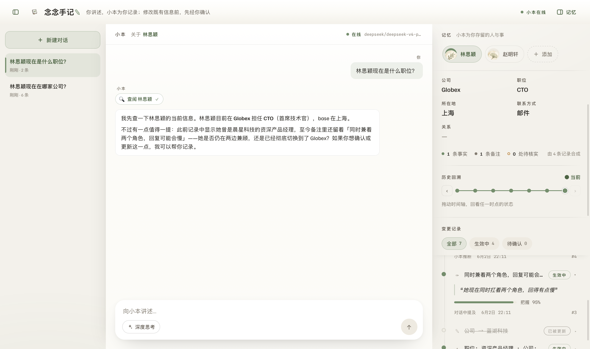
<br><sub>左栏新开的空白线程 · 右栏人卡 = Globex / CTO · 答案直接命中,无需任何上文</sub>
</div>

### 🔧 真在查记忆,不是前端空壳

回答之前,小本先冒出**流式工具条**(`get_contact` running → done),再据此作答。

<div align="center">
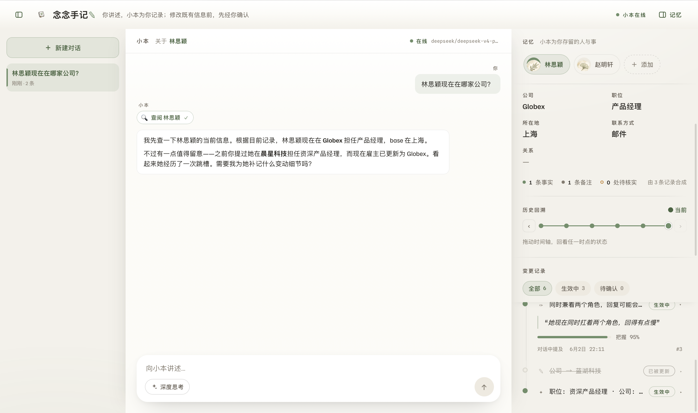
<br><sub>先检索记忆,后开口 —— 这些都是"之前会话"记下的底子</sub>
</div>

### 🚦 改你已有的数据?先过确认闸门

说一句"她升任 CTO 了" → 改既有字段 = 高危,底部弹出**陶土色确认闸门**,点头才落库(human-in-the-loop)。

<div align="center">
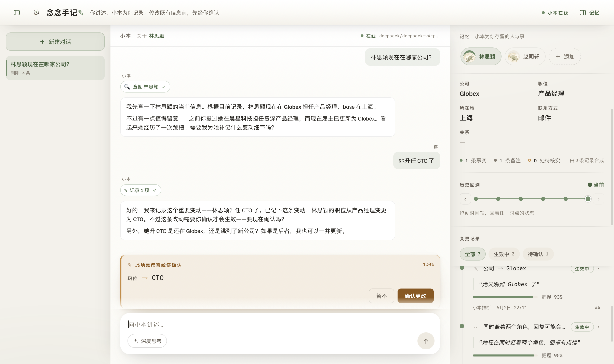
<br><sub>「职位 → CTO ‹暂不 / 确认更改›」· 没你点头,记忆不生效</sub>
</div>

### 🧾 账本:改了什么 · 改之前是什么 · 凭哪句原话

右栏「变更记录」把每一次改动全留痕。**两张图凑成完整的一幕** —— 左边是 before/after 的 supersede 链,右边点开任一条就是逐字溯源。

<div align="center">
<table>
<tr>
<td align="center">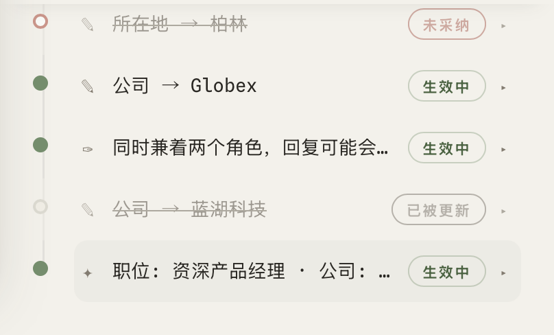</td>
<td align="center">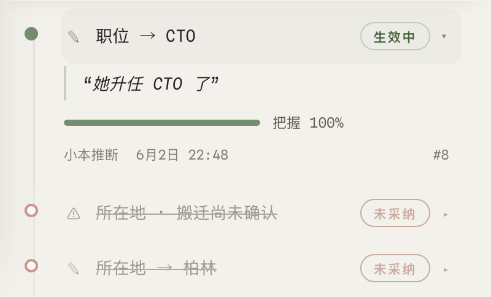</td>
</tr>
<tr>
<td align="center"><sub>📜 <b>变更链</b><br>公司 Globex ← 蓝湖科技 ← 晨星科技(supersede)<br>+ 备注(ANNOTATE)+ 基线(ASSERT)</sub></td>
<td align="center"><sub>🔍 <b>逐字溯源</b><br>原话「她升任 CTO 了」+ 把握 100%<br>+ 来源层级 · 连"未采纳/待核实"都在</sub></td>
</tr>
</table>
</div>

### ⏳ 时光机:任意时点,重建当时的真相

拖动时间轴,人卡会 **morph** 成那一刻的真相。随时间推进,公司 **晨星科技 → 蓝湖科技 → Globex**,而每一刻的真相都由当时已有的 **N 条记录精确合成**(`effective_*_at(as_of)`)—— 这是确定性 SQL 重放,不是近似。

<div align="center">
<table>
<tr>
<td align="center" width="33%">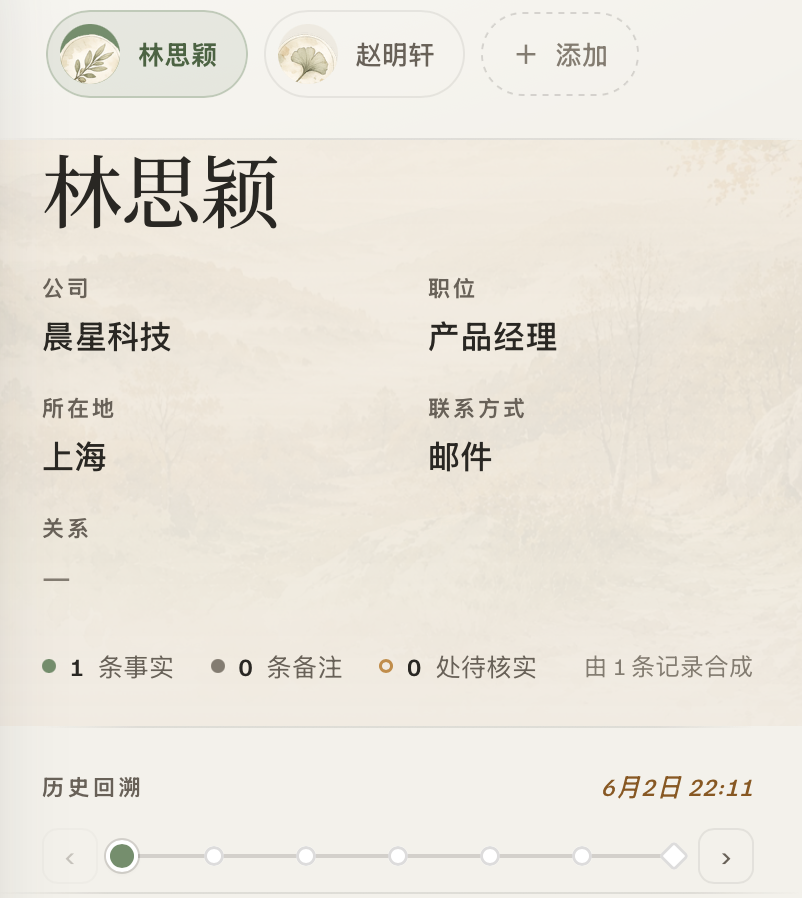</td>
<td align="center" width="33%">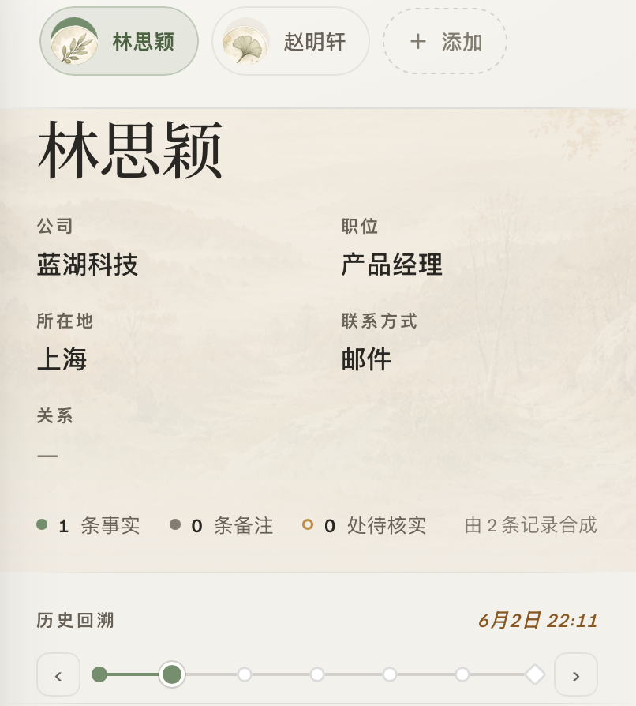</td>
<td align="center" width="33%">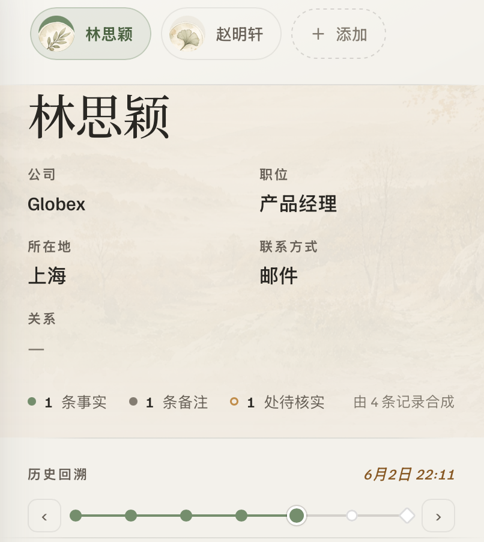</td>
</tr>
<tr>
<td align="center"><sub><b>晨星科技</b><br>由 <b>1</b> 条记录合成<br>· 最初 ·</sub></td>
<td align="center"><sub><b>蓝湖科技</b><br>由 <b>2</b> 条记录合成<br>· 中途 ·</sub></td>
<td align="center"><sub><b>Globex</b><br>由 <b>4</b> 条记录合成<br>· 此刻 ·</sub></td>
</tr>
</table>
<sub>同一张人卡,时间轴拖到哪、真相就回到哪 &nbsp;⟵&nbsp; 合成记录数 1 · 2 · 4 一路累积</sub>
</div>

### 🚫 连"被拒 / 存疑"都留痕

链条不只记成功的改动 —— 被你否掉的(REJECTED)、需要核实的(FLAG)同样完整可审计。

<div align="center">
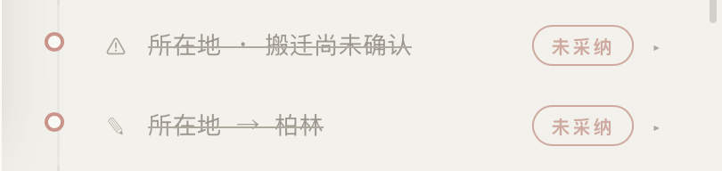
<br><sub>「所在地 → 柏林」未采纳 · 「搬迁尚未确认」⚠ 待核实 —— 5-state 状态机全留底</sub>
</div>

### 💭 顺带:深度思考真接后端 reasoning(不是装饰)

打开输入框的「深度思考」,回复上方会先流式展开**可折叠的推理过程**,再收束成结构化建议。

<div align="center">
<table>
<tr>
<td align="center">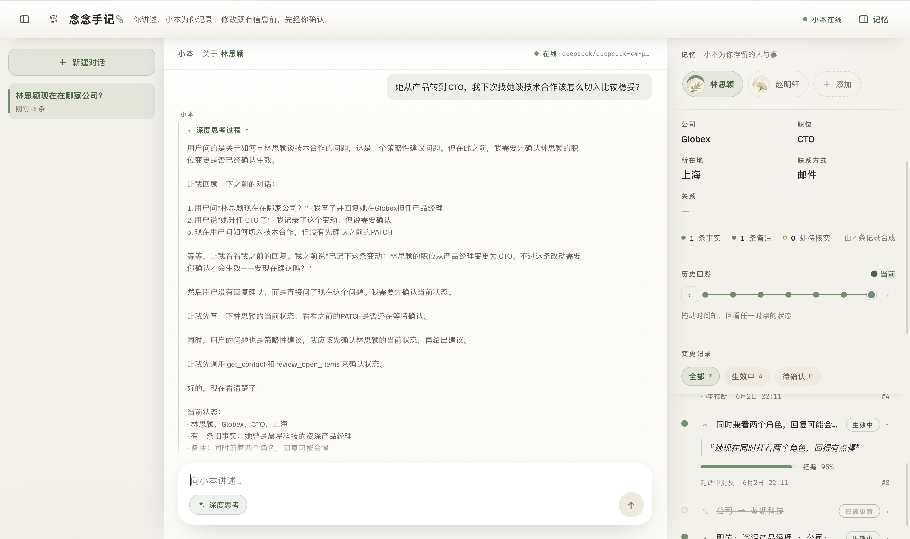</td>
<td align="center">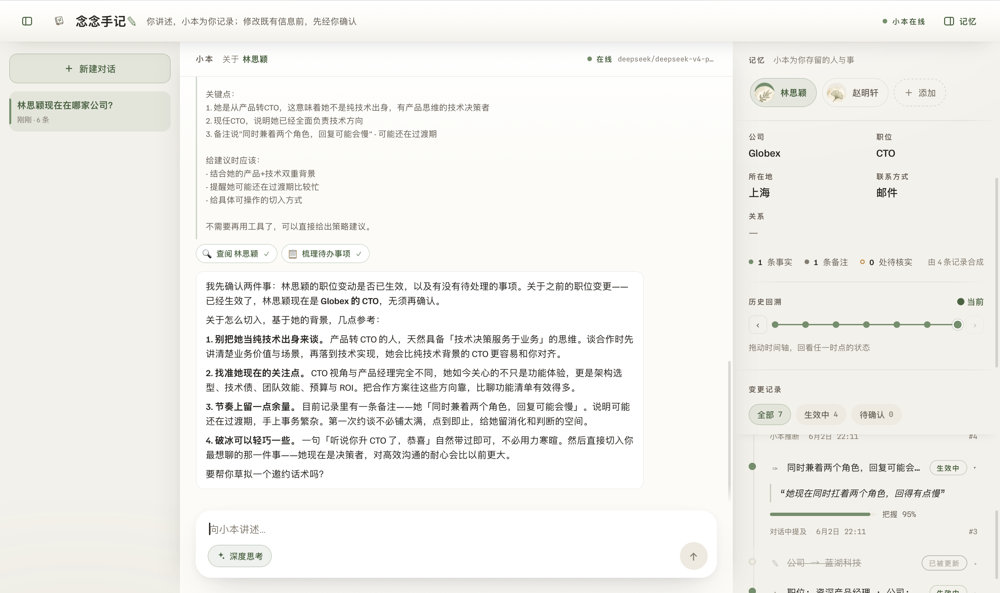</td>
</tr>
<tr>
<td align="center"><sub>推理流式展开</sub></td>
<td align="center"><sub>收束成结构化建议</sub></td>
</tr>
</table>
</div>

---

## ⚖️ 不是又一个 vector memory

**L1.5 Intent Ledger 是 `relational-first` 的 agent 记忆** —— 关系数据库是记忆的**主体与唯一真相**,召回是确定性 SQL,**读路径里没有向量索引**。主流记忆是 `vector-first`:另起一个 embedding 近似索引当记忆、真相活在索引里。一眼归类:**这不是又一个 vector memory,也不是知识图谱。**

> 差异**不在"用不用数据库"** —— Letta / Memobase / Mem0 也跑在 Postgres 上,只是库里装的是**向量索引**。关键是:**关系库为主体 · SQL 为召回 · 读回路无 embedding**。

把它当**对你既有业务表的事件溯源**:agent / 用户每次关于某实体的发言 → 一条 typed intent(`PATCH` / `ASSERT` / `ANNOTATE` / `FLAG`,由 Postgres `CHECK` 在存储层硬强制 shape)→ 写进与业务表**同库共置**的单张账本 `l15_change_intents`。当前真相由 `effective_*_at(as_of_ts)` 按时间戳**确定性重放**合成 —— 同一查询、同一 `as_of_ts`,永远返回同一结果,且能重建实体在**任意过去时刻的完整状态**。

### 三流派速览

| 维度 | 🔎 Vector Memory<br><sub>mem0 / LangMem 等</sub> | 🕸️ 时序 KG<br><sub>Zep / Graphiti</sub> | 🧾 **L1.5 Intent Ledger** |
|---|---|---|---|
| **存储形态** | 自有向量库(+图) | 自有图数据库 | **既有业务表同库 + 单张账本表** |
| **召回** | embedding 语义近似 | 向量 + BM25 + 图遍历 + 重排 | **纯 SQL 精确,无 embedding / LLM** |
| **确定性(读)** | ❌ 非确定、不可复现 | ❌ 非确定 | ✅ **bit-for-bit 可复现** |
| **时间旅行** | ❌ 无(最多时间戳排序) | 🟡 双时态事实区间 + 时间过滤 | ✅ **任意时点整体状态确定性重放** |
| **改口与撤回** | 覆盖 / 累积出排 | 失效非删除 | **新行 + self-FK supersede 链,可回滚** |
| **人工闸门** | ❌ 无(自主写入) | ❌ 无 | ✅ **内建默认:改字段必经人工确认** |
| **出处** | 薄(无逐字/置信/权威) | 可回溯 episode | **逐字 quote + 权威分级 + confidence + priority 仲裁** |
| **强类型** | 无 / 可选 | 可选 ontology(应用层) | ✅ **DB `CHECK` 强制的固定 4-kind** |
| **与 embedding 模型** | 换模型需全量重嵌入、召回漂移 | 换模型需重嵌入 | **解耦:换 LLM 不重嵌入、召回不漂移** |
| **最佳场景** | 长尾记任意话 | 演变型关系记忆 | **可审计 / 可回滚 / 可时间旅行的结构化业务改动** |

> **诚实的边界**:上面每一项**单看都不是全球首创** —— 双时态 DB(如 XTDB)能做更完整的确定性 as-of;Zep / Graphiti 有双时态事实区间;Letta / LangGraph 能拼出 HITL。Intent Ledger 可防守的定位是**组合式护城河**:把「**同库账本 × 确定性 as-of × 默认人工闸门 × DB 强制 4-kind 强出处**」四者**合一、开箱即用**,在主流 agent-memory 产品(Mem0 / Letta / Zep / Cognee / Supermemory / Memobase / 平台原生)里没有第二家做同一件事。
>
> 完整的逐家对抗式核验(含 confidence 与诚实的重叠披露)见 📑 **[`docs/competitive-analysis.md`](docs/competitive-analysis.md)**。

**两套不冲突**:Intent Ledger 不与 vector 抢"记任意话",专做"会改你结构化业务状态、需可审计 / 可回滚 / 可时间旅行"的那部分 —— **vector 当语义索引,Intent Ledger 当事实账本。**

---

## 🗺️ 核心抽象一图

```
                    ┌──────────────────────────────────────────────┐
   用户/Agent 说话 →  │            l15_change_intents (账本表)         │
                    │                                              │
                    │  kind         = PATCH|ASSERT|ANNOTATE|FLAG    │
                    │  status       = PROPOSED→APPLIED→SUPERSEDED  │
                    │                          |REJECTED|EXPIRED   │
                    │  source_layer = USER_DIRECT > L2_FORM >       │
                    │                 L2_CHAT > L2_VOICE >          │
                    │                 AGENT_INFERENCE               │
                    │  source_quote (原话截出来的证据)               │
                    │  confidence   (0–1)                           │
                    └────────────────────────┬─────────────────────┘
                                             │
                            effective_<entity>_at(p_as_of_ts)
                            ── PG SQL function 按时间戳重放 ──
                                             │
                                             ▼
                            ┌──────────────────────────────────────┐
                            │  effective_<entity>  视图 / 函数返回值   │
                            │  ("截至 p_as_of_ts 的真相")            │
                            └────────────────────┬─────────────────┘
                                                 ▼
                                  Agent system prompt 注入 snapshot
                                       (下一轮 LLM 看到)
```

---

## 🐳 跑起来看(Docker,一行起全栈对话台)

装了 Docker 就够,不用本地 Python / Node / Postgres:

```bash
cp .env.example .env       # 填入 LLM_API_KEY (真 LLM 对话); 不填则 mock 模式
docker compose up --build  # 起 db + api + web
# 浏览器打开 http://localhost:8080
docker compose down -v     # 用完清掉 (含数据卷)
```

这是一个**对话式、真 LLM 驱动**的 Personal-CRM 记忆台(门面名「念念手记」, 对话助手「小本」):
你说一句话 → LLM 实时回复并**产出结构化 intent** → **高危改动先挂确认闸门等你拍板** →
确认后才落库 → 拖**时光机**回看任意时点的真相 → 每条事实带**逐字 `source_quote` 溯源**。

| 服务 | 端口 | 说明 |
|---|---|---|
| `web` | http://localhost:8080 | React 前端(nginx 服务 + 反代 `/api`) |
| `api` | http://localhost:8000 | FastAPI 后端(SSE 对话 / 时光机 / 账本 / 确认闸门) |
| `db` | localhost:5433 | Postgres(开发档调优) |

> 没配 `LLM_API_KEY` 也能起:seed 的林思颖故事、时光机、溯源、账本都能看,只是对话走 mock 不写真记忆。
> 接任意模型只改三个 env(`LLM_MODEL` / `LLM_API_KEY` / `LLM_BASE_URL`,走 LiteLLM),见 `.env.example`。
> 后端/前端各有 README(`api/README.md`、`web/`)。原命令行脚本 demo 仍在:`docker compose --profile demo run --rm demo`。
> 库的 103 个测试走本地 `pytest`(testcontainers 自起 PG),见下方"5 分钟上手"。

---

## 📖 5 分钟上手

按这个顺序读 + 改:

1. **`docs/01-design.md`** — 先理解每个抽象解决什么问题 (20-30 min)
2. **`docs/02-schema-template.sql`** — copy, 把 `-- TODO` 注释处换成你的实体表名 (10 min)
3. **`docs/03-runtime-template.py`** — 应用层 helper, 业务字段全是占位符, 改完直接 import (15 min)
4. **`docs/04-integration-guide.md`** — 接 LLM agent 的 system prompt 模板 + JSON 输出契约 + effect handler 写法 (15 min)

## 🧭 文件导航

| 文件 | 给谁读 | 形态 |
|---|---|---|
| README.md (本文) | 第一次看的人 | 总览 + 5 分钟决策 |
| docs/01-design.md | 想理解为什么这么设计 | 设计理念长文 |
| docs/02-schema-template.sql | 想直接改 schema 跑起来 | 可 copy PG DDL |
| docs/03-runtime-template.py | 写应用层代码 | 可 copy Python helper |
| docs/04-integration-guide.md | 接 LLM | 集成指南 |
| docs/competitive-analysis.md | 想看 vs mem0 / Letta / Zep… 的逐家核验 | 竞品分析(带引用 + 对抗式验证) |
| docs/demo-script.md | 想复刻上面那组截图 / 录讲解视频 | 分幕演示脚本 |

## 🚧 何时**不**该用这套

- 用户说什么都想记 (开放对话, 长尾偏好) — 用 vector memory
- entity 形状不稳定, 一周改三次 schema — migration + `effective_*_at` 函数也要重写, 工程成本不值
- 只需要近似召回 / 模糊匹配 — 这是精确召回
- 单纯日志, 不需要"截至此刻的真相"合成 — append-only log 表就够

## 📌 现状

- 这套设计基于关系数据库设计的 agent 记忆, 你看到的模板代码是以占位符字段提供的模板
- 文档全程用虚构 **TodoAgent** 举例 — 可替换为你的业务
- 你 copy 走自负责
