<div align="center">

# Memory Ledger

### 基于关系数据库的 Agent 记忆方案 —— 以账本记录,而非向量嵌入

[](LICENSE) &nbsp; &nbsp; &nbsp;

<p>
将 agent 与用户关于业务实体的每次陈述记为一条 <b>typed intent</b>,写入单张<b>账本表</b>;<br>
由纯 <b>SQL 函数</b>按时间戳<b>确定性重放</b>出任意时刻的真相。<b>读路径不含向量与 LLM。</b><br>
<sub><b>relational-first</b> 的 agent 记忆设计与参考实现 · 易于扩展到你自己的业务 · 非 RAG / 向量 / 知识图谱</sub>
</p>

<table>
<tr>
<td align="center">❌ &nbsp;<b>vector-first(主流)</b></td>
<td align="center">✅ &nbsp;<b>relational-first(本方案)</b></td>
</tr>
<tr>
<td align="center">记忆存入 embedding 近似索引<br><sub>非确定 · 随模型漂移 · 难以精确查询 · 不可读</sub></td>
<td align="center">记忆即关系表中的<b>账本行</b><br><sub>确定性 SQL · 可时间旅行 · 可审计 · 与嵌入模型解耦</sub></td>
</tr>
</table>

<sub>🧾 同库账本 &nbsp;·&nbsp; ⏳ 确定性 as-of 时间旅行 &nbsp;·&nbsp; 🚦 默认人工闸门 &nbsp;·&nbsp; 🔢 DB 强制 4-kind</sub>

</div>

---

## 💡 概述

将 agent 与用户的每次"事实陈述 / 字段改动 / 注释 / 标疑"记为一条 intent,写入同一张账本表 `l15_change_intents`;再由 PostgreSQL view 函数 `effective_*_at(as_of_ts)` 按时间戳合成"截至此刻的真相",供 agent 下一轮作为 context。跨会话记忆由此实现 —— **依赖 SQL 与时间戳,而非 embedding 与相似度**。

Memory Ledger 是这套记忆机制的**设计与参考实现** —— 采用分层架构,账本核心(typed intent + `effective_*_at` 时点重放)与具体业务实体解耦。把示例实体换成你自己的业务表、核心逻辑原样复用,即可**轻松扩展到自身业务**;这正是它的设计目标。文档以虚构的 **TodoAgent** 贯穿示例;对话应用「念念手记」仅为该理念的可视化外壳(参见下文演示)。

---

## ⚖️ 关系数据库,而非 embedding

Memory Ledger 为 `relational-first`:关系数据库是记忆的**主体与唯一真相**,召回为确定性 SQL,**读路径不含向量索引**。主流方案为 `vector-first`,以独立的 embedding 近似索引承载记忆。

> 差异不在于**是否使用数据库** —— Letta、Memobase、Mem0 同样运行于 Postgres,但库中存储的是向量索引。关键在于:**关系库为主体、SQL 为召回、读路径不含 embedding**。

其本质为**对既有业务表的事件溯源**:intent 分 `PATCH` / `ASSERT` / `ANNOTATE` / `FLAG` 四类,由 Postgres `CHECK` 在存储层强制 shape;账本与业务表**同库共置**,`effective_*_at` 可重建任意过去时刻的完整状态。

### 关系库为主体所带来的能力(向量方案无法提供)

| 关系库为主体 | 向量为主体 |
|---|---|
| ✅ 确定性、可复现召回 | 相似度排序 + LLM 抽取,固有非确定 |
| ✅ 精确查询(按 entity / field / date) | 仅近似语义召回,难以回答"某字段当前值" |
| ✅ as-of 时点重放(SQL 函数重算) | 索引无时间维度 |
| ✅ 与业务数据同库、同事务一致 | 记忆独立存储,需同步两份真相 |
| ✅ 可读、可人工审计 | embedding 不可读,调试困难 |
| ✅ 与嵌入模型解耦 | 更换嵌入模型须全量重嵌入,召回随之漂移 |

### 与主流方案对照

| 维度 | 🔎 Vector Memory<br><sub>mem0 / LangMem 等</sub> | 🕸️ 时序 KG<br><sub>Zep / Graphiti</sub> | 🧾 **Memory Ledger** |
|---|---|---|---|
| **存储形态** | 自有向量库(+图) | 自有图数据库 | **既有业务表同库 + 单张账本表** |
| **召回** | embedding 语义近似 | 向量 + BM25 + 图遍历 + 重排 | **纯 SQL 精确,无 embedding / LLM** |
| **确定性(读)** | ❌ 非确定 | ❌ 非确定 | ✅ **bit-for-bit 可复现** |
| **时间旅行** | ❌ 无 | 🟡 双时态事实区间 + 过滤 | ✅ **任意时点整体状态重放** |
| **改口与撤回** | 覆盖 / 累积出排 | 失效非删除 | **新行 + self-FK supersede 链,可回滚** |
| **人工闸门** | ❌ 无 | ❌ 无 | ✅ **内建默认:改字段须确认** |
| **出处** | 薄 | 可回溯 episode | **逐字 quote + 权威分级 + confidence + priority 仲裁** |
| **强类型** | 无 / 可选 | 可选 ontology(应用层) | ✅ **DB `CHECK` 强制的固定 4-kind** |
| **与嵌入模型** | 换模型须全量重嵌入 | 换模型须重嵌入 | **解耦:换 LLM 不重嵌入** |
| **最佳场景** | 长尾记任意话 | 演变型关系记忆 | **可审计 / 可回滚 / 可时间旅行的结构化改动** |

> **边界说明**:上述各项单独而言均非首创 —— 双时态数据库(如 XTDB)可实现更完整的确定性 as-of,Zep / Graphiti 具备双时态事实区间,Letta / LangGraph 可组合出 HITL。Memory Ledger 的可防守定位在于**组合**:将「同库账本 × 确定性 as-of × 默认人工闸门 × DB 强制 4-kind 强出处」四者合一并开箱交付;在主流 agent-memory 产品中尚无对位者(已逐家对抗式核验)。

**两者互补**:Memory Ledger 不与向量方案争"记任意话",专司"修改结构化业务状态、需可审计 / 可回滚 / 可时间旅行"的部分 —— **向量作语义索引,Memory Ledger 作事实账本**。

---

## 🗺️ 核心抽象

```
                    ┌──────────────────────────────────────────────┐
   用户/Agent 说话 →  │            l15_change_intents (账本表)         │
                    │                                              │
                    │  kind         = PATCH|ASSERT|ANNOTATE|FLAG    │
                    │  status       = PROPOSED→APPLIED→SUPERSEDED  │
                    │                          |REJECTED|EXPIRED   │
                    │  source_layer = USER_DIRECT > L2_FORM >       │
                    │                 L2_CHAT > L2_VOICE >          │
                    │                 AGENT_INFERENCE               │
                    │  source_quote (原话截出来的证据)               │
                    │  confidence   (0–1)                           │
                    └────────────────────────┬─────────────────────┘
                                             │
                            effective_<entity>_at(p_as_of_ts)
                            ── PG SQL function 按时间戳重放 ──
                                             │
                                             ▼
                            ┌──────────────────────────────────────┐
                            │  effective_<entity>  视图 / 函数返回值   │
                            │  ("截至 p_as_of_ts 的真相")            │
                            └────────────────────┬─────────────────┘
                                                 ▼
                                  agent 经工具按需查询(或注入为 snapshot)
                                       → 下一轮 LLM 据此作答
```

---

## 🧠 作为 Agent Memory 基础设施 —— 工具变薄,智能涌现

账本本身即一层 **Agent Memory 基础设施**:agent 的上下文**不预载记忆**,需要什么便经工具按需查询。由于底层是**可精确查询的结构化账本**(而非不可读的向量或追加文本),**一次工具调用**即可取回某实体的完整画像 —— 当前真相、逐字溯源、存疑标记、完整变更链、任意时点回看。

因此**上层工具极薄**:工具仅是账本读能力的轻包装,合成真相、溯源与时点重放均由基础设施承担,新增一种工具几乎零成本。

**由此带来智能的涌现**:正因记忆可被精确查询,agent 在**几乎无上下文积累**(冷启动、全新会话)时,仅凭一次工具调用即可获得足够丰富的历史,从而表现出对某人"深知其详"的连续记忆。这种能力**涌现自"基础设施 + 薄工具"**,而非堆叠上下文或依赖精巧的提示词。

反之,若将 agent 的产出直接追加进向量库或词表,便无法查询完整的意图链 —— 只能得到近似的相似召回,既无 before/after、无溯源、无时点重放。**能让薄工具如此有力,正是这套关系账本设计的价值所在。**

---

## 🎬 演示(外壳为可视化延伸)

<div align="center">

<br><sub><b>「念念手记」· 对话助手「小本」</b> —— 该数据库理念的可视化外壳</sub>
</div>

账本本身不可见(即数据库中的行)。为便于理解,以其构建了一个对话式 Personal-CRM 记忆台作为演示;**外壳仅为演示,核心交付为上述设计**。下列画面均在真实 `live` LLM(DeepSeek)上运行产生,示例联系人为 **林思颖**(资深产品经理 → CTO,公司 晨星科技 → 蓝湖科技 → Globex)。

### 🧠 跨会话记忆

新建空白线程并询问"她现在的职位",在毫无上文的新线程中,系统仍调用 `get_contact` 并准确回答 **CTO**。记忆按**实体**全局留存、跨会话共享。

<div align="center">
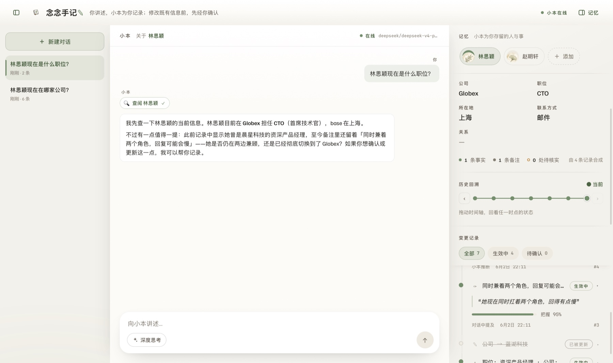
<br><sub>左栏为新建空白线程 · 右栏人卡为 Globex / CTO · 无需任何上文即命中</sub>
</div>

### 🔧 流式工具调用

回答前先以流式工具条检索记忆(`get_contact` running → done),再据此作答;表明系统确在查询记忆,而非前端预设。

<div align="center">
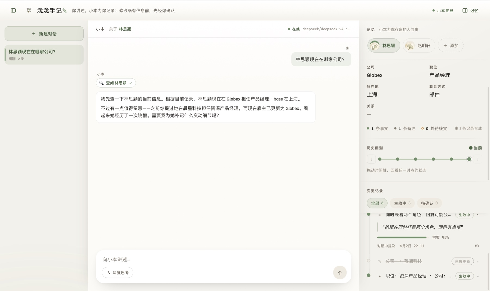
<br><sub>先检索、后作答 —— 数据均来自既往会话的积累</sub>
</div>

### 🚦 确认闸门

陈述"她升任 CTO 了"将修改既有字段(高危操作),底部弹出**确认闸门**,经确认方写入。

<div align="center">
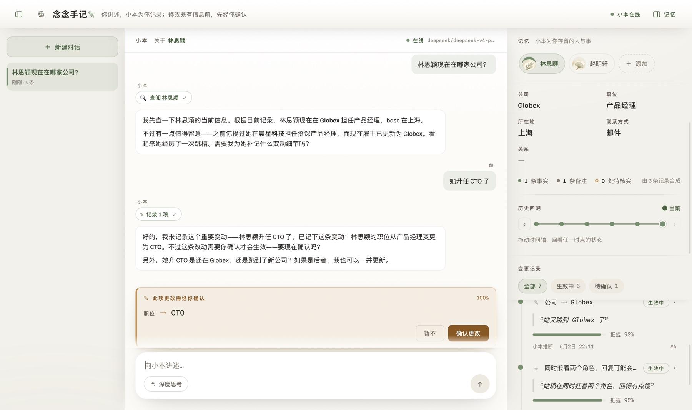
<br><sub>「职位 → CTO ‹暂不 / 确认更改›」· 未经确认不进入生效真相(PROPOSED)</sub>
</div>

### 🧾 账本与溯源

右栏「变更记录」留存每一次改动。两图共同呈现完整链路:左为 before/after 的 supersede 链,右为展开后的逐字溯源。

<div align="center">
<table>
<tr>
<td align="center">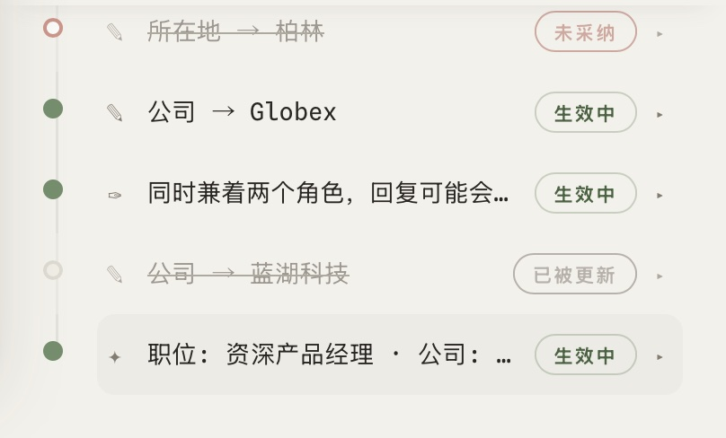</td>
<td align="center">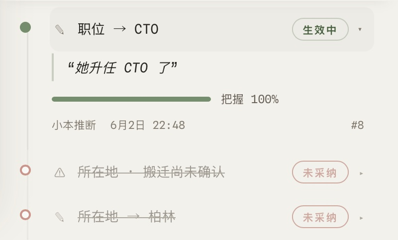</td>
</tr>
<tr>
<td align="center"><sub>📜 <b>变更链</b>:公司 Globex ← 蓝湖科技 ← 晨星科技(supersede)+ 备注 + 基线</sub></td>
<td align="center"><sub>🔍 <b>逐字溯源</b>:原话「她升任 CTO 了」+ 把握 100% + 来源层级</sub></td>
</tr>
</table>
</div>

### ⏳ as-of 时光机

拖动时间轴,人卡随之重建该时刻的真相:公司依次为 晨星科技 → 蓝湖科技 → Globex,各时刻均由当时已有的 N 条记录经 `effective_*_at(as_of)` 确定性合成。

<div align="center">
<table>
<tr>
<td align="center" width="33%">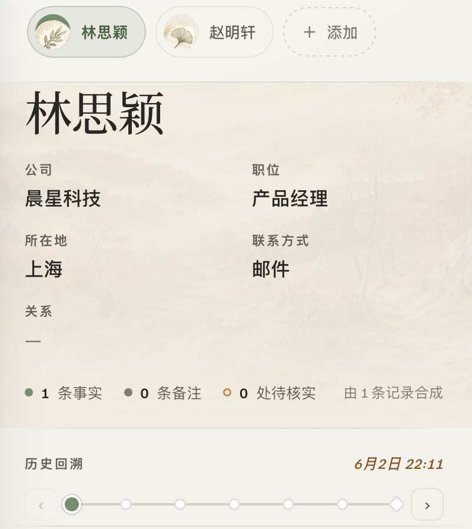</td>
<td align="center" width="33%">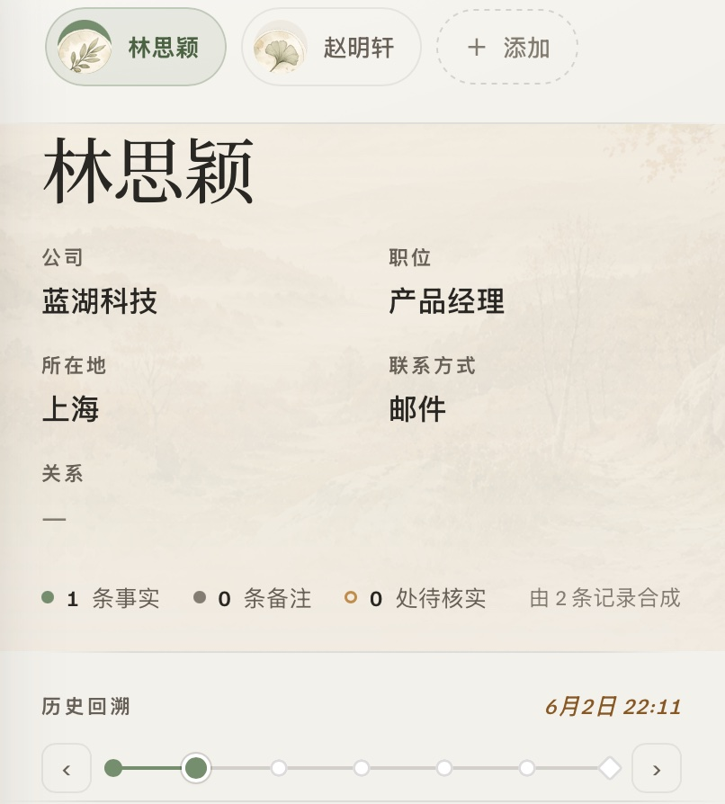</td>
<td align="center" width="33%">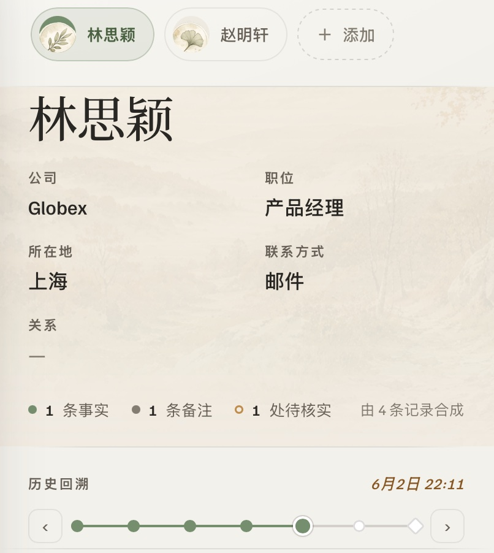</td>
</tr>
<tr>
<td align="center"><sub><b>晨星科技</b> · 由 <b>1</b> 条记录合成</sub></td>
<td align="center"><sub><b>蓝湖科技</b> · 由 <b>2</b> 条记录合成</sub></td>
<td align="center"><sub><b>Globex</b> · 由 <b>4</b> 条记录合成</sub></td>
</tr>
</table>
<sub>同一人卡随时间轴重建 · 合成记录数 1 · 2 · 4 逐步累积</sub>
</div>

### 🚫 拒绝与存疑留痕

链条不止记录成功改动 —— 被拒绝(REJECTED)与待核实(FLAG)同样完整可审计。

<div align="center">
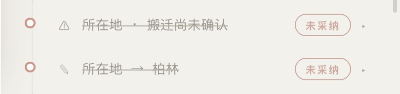
<br><sub>「所在地 → 柏林」未采纳 ·「搬迁尚未确认」待核实 —— 5-state 状态机全程留痕</sub>
</div>

### 💭 深度思考

启用「深度思考」后,回复上方先流式展开可折叠的推理过程,再收束为结构化建议;该开关接入后端 reasoning 链路。

<div align="center">
<table>
<tr>
<td align="center">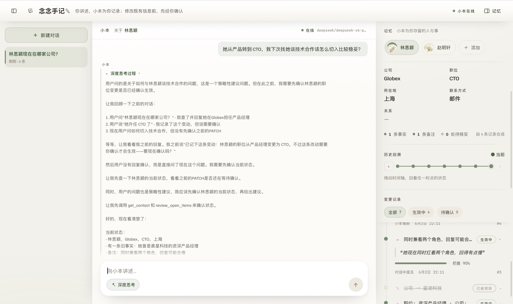</td>
<td align="center">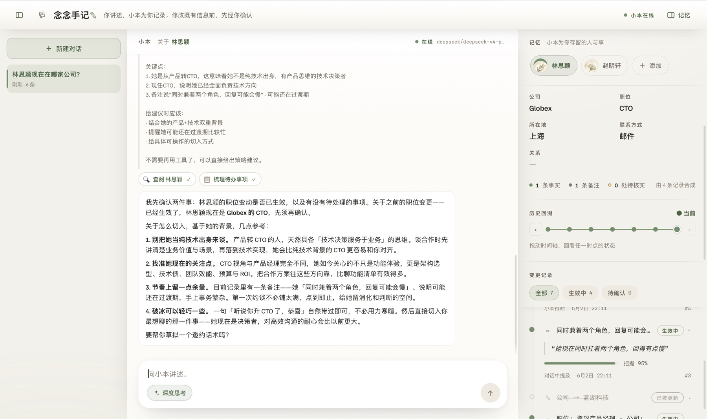</td>
</tr>
<tr>
<td align="center"><sub>推理流式展开</sub></td>
<td align="center"><sub>收束为结构化建议</sub></td>
</tr>
</table>
</div>

---

## 🐳 本地运行(Docker)

仅需 Docker,无需本地 Python / Node / Postgres:

```bash
cp .env.example .env       # 填入 LLM_API_KEY (真 LLM 对话); 不填则 mock 模式
docker compose up --build  # 起 db + api + web
# 浏览器打开 http://localhost:8080
docker compose down -v     # 用完清掉 (含数据卷)
```

| 服务 | 端口 | 说明 |
|---|---|---|
| `web` | http://localhost:8080 | React 前端(nginx 服务 + 反代 `/api`) |
| `api` | http://localhost:8000 | FastAPI 后端(SSE 对话 / 时光机 / 账本 / 确认闸门) |
| `db` | localhost:5433 | Postgres(开发档调优) |

> 未配置 `LLM_API_KEY` 亦可启动:seed 数据、时光机、溯源、账本均可查看,仅对话走 mock、不写入真实记忆。
> 更换模型仅需调整三个环境变量(`LLM_MODEL` / `LLM_API_KEY` / `LLM_BASE_URL`,经 LiteLLM),见 `.env.example`。
> 后端 / 前端各附 README(`api/README.md`、`web/`);命令行脚本 demo:`docker compose --profile demo run --rm demo`。库含 103 个测试,经本地 `pytest`(testcontainers 自起 PG)运行。

---

## 🚧 不适用场景

- 需记录任意开放内容(长尾偏好)—— 宜用 vector memory
- entity 形状不稳定、频繁变更 schema —— migration 与 `effective_*_at` 函数须同步重写,成本不值
- 仅需近似召回 / 模糊匹配 —— 本方案为精确召回
- 仅需日志、无需"截至此刻的真相"合成 —— append-only 日志表已足够

## 📌 说明

- 示例实体与数据均为虚构占位(TodoAgent / 念念手记),替换为你自己的业务实体即可扩展
- 复用风险自负

## 📮 联系

[](mailto:huangsuxiang5@gmail.com) &nbsp; &nbsp;

## 📄 开源协议

本项目以 **[Apache License 2.0](LICENSE)** 开源,详见根目录 [`LICENSE`](LICENSE) 与 [`NOTICE`](NOTICE)。
